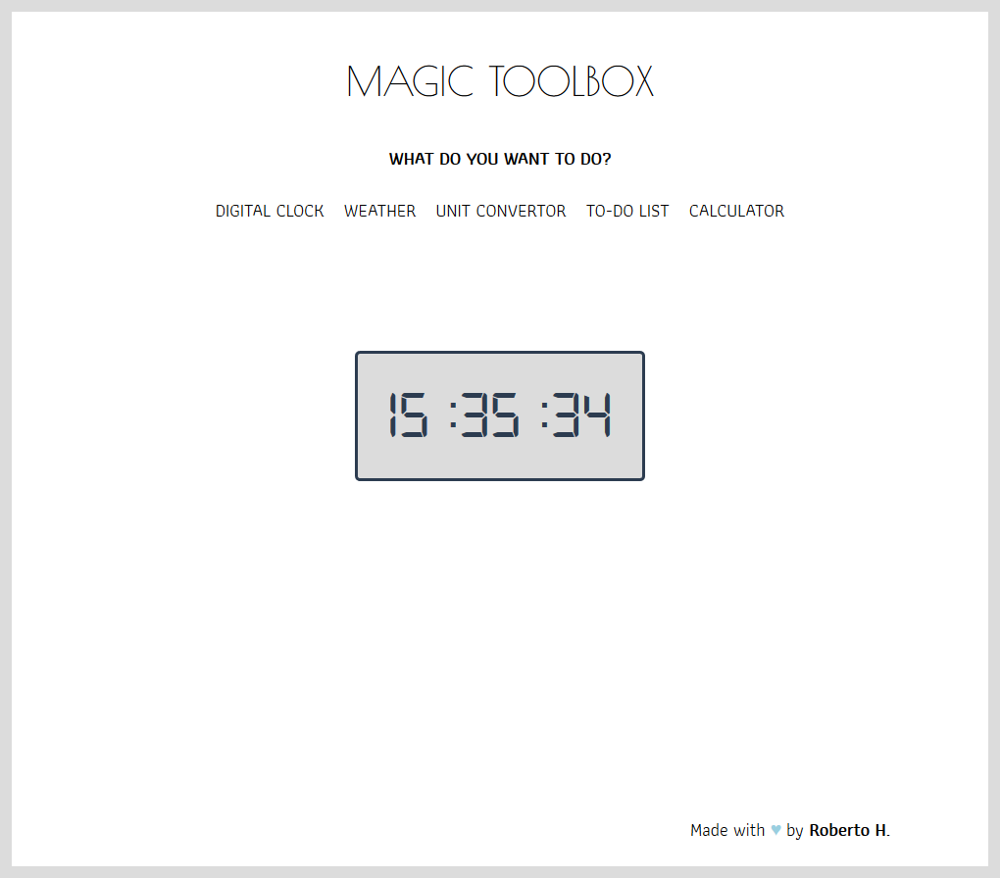
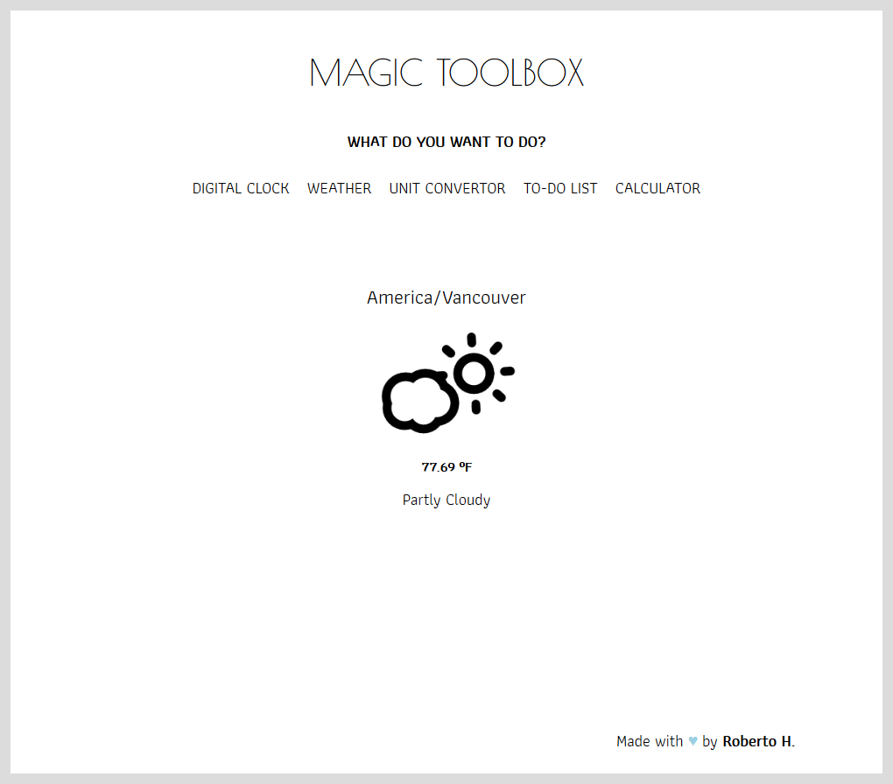
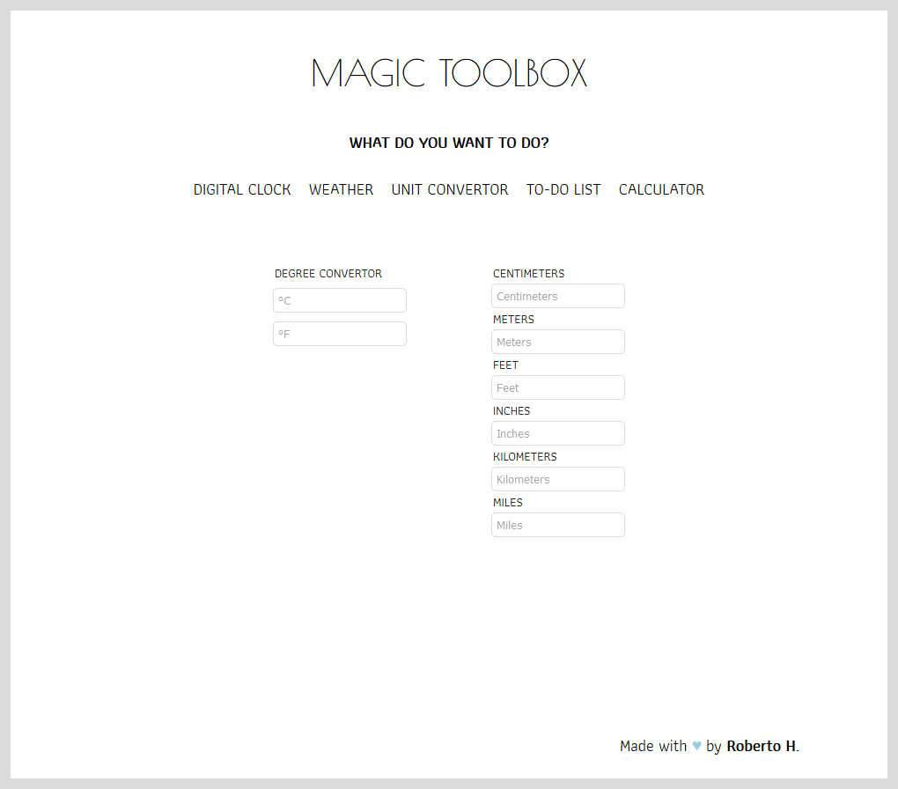
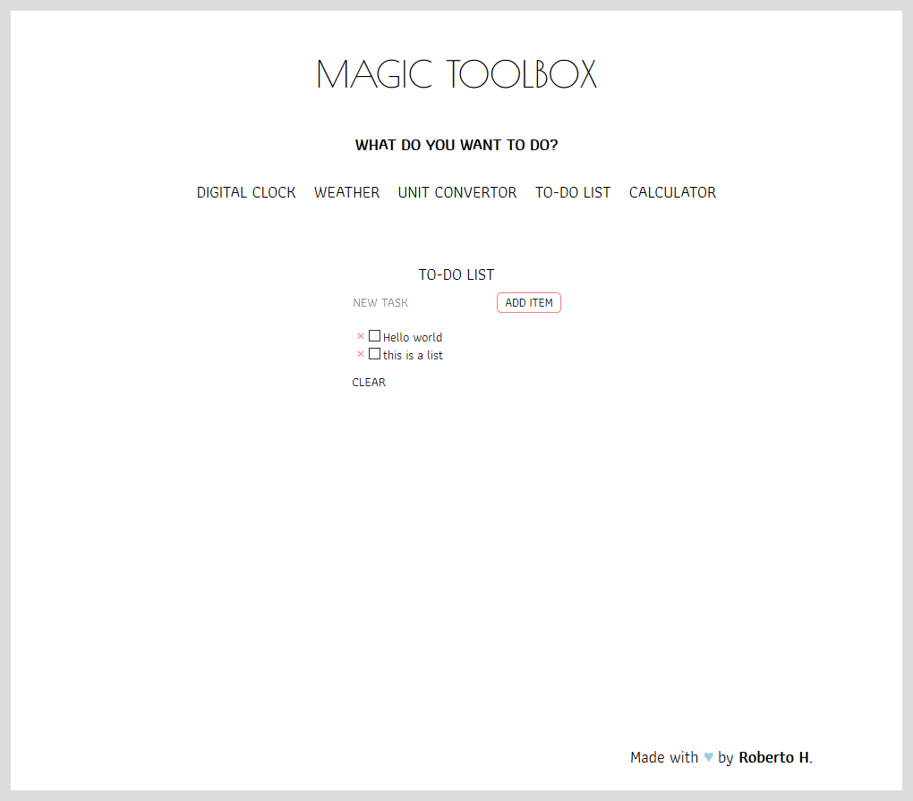
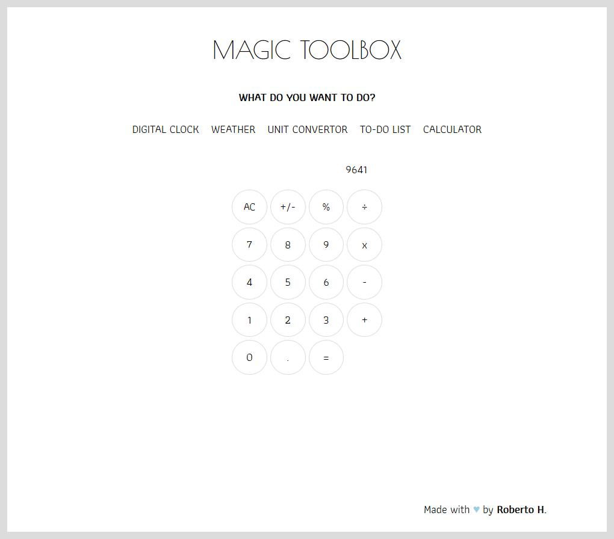

<p align="center">
    
</p>

## Magic ToolBox! 🧙

Magic Toolbox! is a multi-tool app designed with the following useful everyday utilities: 
    - Digital Clock
    - Weather
    - Unit Converter
    - To-do List
    - Digital Calculator

Made with JavaScript, Sass, HTML, Gulp

## Installation
 ```sh
$ git clone https://github.com/robhhr/magic-toolbox
$ cd magic-toolbox
$ npm install all
```
Run server:
```sh
$ gulp
```

## Technologies Used

* VS Code
* HTML
* Sass
* JavaScript
* Gulp

## Project Comps
### Digital Clock


### Weather


### Unit Converter


### To-do List


### Calculator


This project was created with 💙 by <a href="https://twitter.com/hallorob">Roberto</a>
